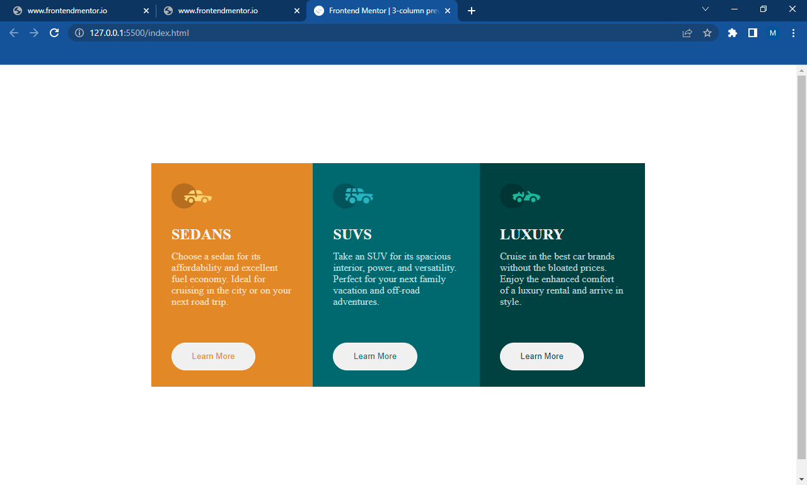

# Frontend Mentor - 3-column preview card component solution

This is a solution to the [3-column preview card component challenge on Frontend Mentor](https://www.frontendmentor.io/challenges/3column-preview-card-component-pH92eAR2-). Frontend Mentor challenges help you improve your coding skills by building realistic projects. 

## Table of contents

- [Overview](#overview)
  - [The challenge](#the-challenge)
  - [Screenshot](#screenshot)
  - [Links](#links)
- [My process](#my-process)
  - [Built with](#built-with)
  - [What I learned](#what-i-learned)
  - [Continued development](#continued-development)
  - [Useful resources](#useful-resources)
- [Author](#author)
- [Acknowledgments](#acknowledgments)

## Overview

### The challenge

Users should be able to:

- View the optimal layout depending on their device's screen size
- See hover states for interactive elements

### Screenshot

### Links

- Solution URL: (https://your-solution-url.com)
- Live Site URL: (https://your-live-site-url.com)

## My process

### Built with

- Semantic HTML5 markup
- CSS custom properties
- Flexbox
- [Styled Components](https://styled-components.com/) - For styles

### What I learned

I learnt how to use the display method and the flex direction to set it to a colunm view. I also had to use em in styling the whole body to make the page responsive.

### Continued development

I want to still develop on making my task responsive for all screens.

## Author

- Website - (https://favour-markson-resume.herokuapp.com/)
- Frontend Mentor - (https://www.frontendmentor.io/profile/Markson17)
- Twitter - (https://www.twitter.com/MarksonFavour1)

## Acknowledgments

I would like to give credits to mentors in the frontend mentor community that has given me feedbacks to my completed projects on frontend mentor.

